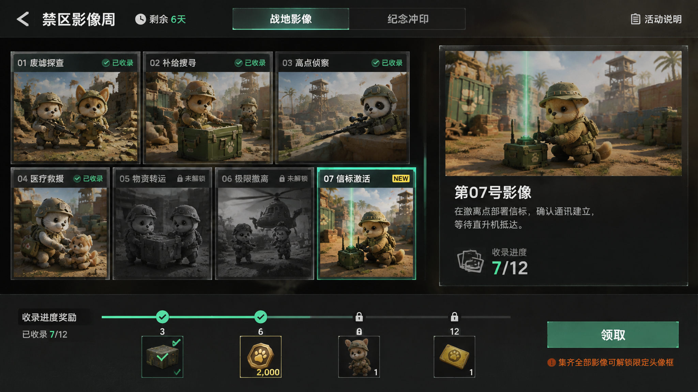

# 禁区影像周 UI 开发基准题面

| 项目 | 固定值 |
| --- | --- |
| Benchmark ID | `ui-development-workflow/photo-week-v1` |
| 题面版本 | `1.2.0` |
| 界面类型 | 全屏活动 Canvas |
| 设计分辨率 | `1280 x 720`，16:9 |
| 业务数据 | 仅本地 mock |
| 正式入口 | 不接入，只提供开发态调试入口 |

本文件是每轮首版实现唯一的产品题面。执行者可以按仓库规则读取 AGENTS、skill 和各 owner 文档，但在首版完成前不读取同目录 `README.md`、`adjustment.md` 或历史结果。

## 执行约束

- 收到本题面后直接完成 Source、Reference、Publish、program 接入和可自动完成的运行验收。题面故意留给 UI 开发者判断的视觉与实现细节由执行者自行决定，不为这些内容回问用户。
- 调用方会在启动 prompt 中明确授予本轮所需的工作区写入、Unity Editor、UnityMCP 和 game-mcp 操作范围。执行者遵守该范围，不提交版本控制、不清理实验产物、不覆盖无关改动。
- Source、Reference、Prototype 和 Directory 文档的创建与修改只通过 UI Authoring CLI 的语义写入口完成。复杂批量 Source 修改使用 `edit --ops`，Reference 修改使用 `reference-edit --ops`；operation JSON、Publish plan 和 Capture 可以写入 `tools/ui-authoring/.runtime/`。通用文件写入工具或脚本直接改 authoring 文档会使本轮样本无效。
- CLI 的 Source、`--ops`、`--plan` 和 `--out` 参数均使用仓库相对路径，不按当前 shell 目录拼接。Windows PowerShell 调用 npm 使用 `npm.cmd`，Bash 使用 `npm`。Publish 保留完整结构化输出；只在结果明确要求 confirmation、报告瞬时错误或给出 Editor claim blocker 时重试，不为截取或重新解析输出重复创建 job。
- 本轮固定使用 `Assets/Resources/UI/Textures/UIWorkflowBenchmarkPhotoWeek` 及其 Unity `.meta` 中的基线图片，不重新生成、替换或改写这些资源。图片如何映射到 mock 数据仍由执行者决定。
- 只有外部工具不可达、权限或认证缺失、工作区冲突、必须取得额外破坏性操作授权等无法自行消除的条件，才可以提前停止；停止时直接报告已完成内容和准确 blocker，不发起开放式讨论。
- 执行者不计时、不估算 token、不填写 benchmark 结果、不修改本目录的 benchmark 文档。CLI、MCP 和模型事件由会话与进程日志自然留存，之后交给独立分析者处理。
- 首版验收完成后，以常规交付摘要结束本阶段，等待调用方在同一 session 中下发独立调整题面。

## 一句话说明

制作一个与《萌兽禁区》气质一致、但不属于当前游戏需求的限时周边活动界面“禁区影像周”。玩家可以在两个分页中浏览战地影像、领取收集奖励，并完成纪念冲印委托。

这个界面用于验证完整 UI 开发流程。它需要形成可运行的 Source、Prefab、generated binding 和 TypeScript 交互，但只使用本地 mock 数据，通过开发态调试入口打开，不接正式大厅或服务器。

## 玩家看到什么

界面铺满整个 Canvas。顶部固定放置返回、活动标题、剩余时间、两个页签和活动说明入口；正文随页签切换，背景与顶部框架不重复创建。视觉上保持萌系战术动物、战地纪实和轻量纪念活动的结合，信息层级清楚，按钮和状态在深色背景上容易辨认。

两个分页分别是：

- `战地影像`：按给定参考图完成，重点测试参考图到 Source 的还原。
- `纪念冲印`：只按文字完成，重点测试从需求推导布局、状态和交互。

分页由两个独立 Page Widget 承担，并由 Canvas owner 使用 `PageViewRoot` 管理。首次打开默认显示 `战地影像`；切换分页后再切回，保留本轮运行中的选择和列表状态。

## Page 1：战地影像

参考图用于确定构图、层级、密度、暗色战术氛围和绿色强调色，不作为整张背景直接贴入运行界面。实现以 `1280 x 720` 重新排布，影像使用固定基线目录中的 `BattlePhoto01.png` 至 `BattlePhoto07.png` 和 `BattlePhotoDetail.png`；12 条记录可以复用这组影像。

左侧是可滚动的影像卡片集合，右侧是当前选中影像的放大图、标题、描述和收录进度，底部是四档收集奖励。主要行为如下：

- 使用 `ScrollRectEx` 和项目既有 custom scroll view 展示至少 12 条 mock 影像，首屏不能显示全部内容，必须能实际滚动。
- 影像卡片是独立 `BattlePhotoCardWidget`。先在 Page 内制作一个代表性内联卡片，再通过 UI Authoring `extract-widget` 完成抽取；实际执行 preview、write 和后续验证，不用直接手写最终 Widget 绕过抽取流程。
- 初始数据为 `7/12` 已收录，默认选中第 07 号影像。首屏同时能看见已收录、未解锁、`NEW` 和选中表现。
- 卡片的可用状态、`NEW` 标记和选择表现是可组合的独立状态轴，不用一个互斥状态枚举硬凑所有组合。
- 点击卡片更新右侧详情和选择框。锁定卡片仍可查看，但要明确显示解锁条件，不能伪装成可领取内容。
- 底部里程碑固定为 `3 / 6 / 9 / 12`。初始时 3 档已领取、6 档可领取、9 与 12 档锁定。
- 点击 6 档奖励后立即切换为已领取，显示一次奖励反馈；重复点击不能重复发放。
- 总收集进度使用可复用 `ProgressBarWidget`，只读进度不用 `Slider` 代替。

## Page 2：纪念冲印

这一页没有视觉参考图。请只根据以下内容完成布局与视觉判断。

Page 内使用基线资源 `PrintCommissionBackground.png` 铺满页面。左侧约 45% 保留为活动主题主视觉，主要表现携带相机或胶片箱的萌系战术动物；右侧约 55% 是纵向委托列表。主视觉与列表应属于同一张完整画面，列表区域可以增加压暗或半透明底板保证阅读，不把左右两侧做成两个互不相关的页面。

右侧使用 `ScrollRectEx` 和独立 `PrintCommissionItemWidget`：

- 固定准备 8 条 mock 委托，首屏约显示 4 条，确保能实际滚动。
- 每条包含一至两行委托描述、`当前值/目标值` 数字进度、一至三个奖励物品图标及数量，以及固定宽度的状态区域。奖励物品框通过 `PrefabRef` 复用现有 `ItemSlotQualityBase` Artifact，图标与数量仍由委托条目负责，不为 benchmark 新建另一套品质框。
- 初始状态分布固定为：2 条 `locked`、3 条 `inProgress`、2 条 `claimable`、1 条 `claimed`。列表中要同时看得到进度差异和状态差异。
- `locked` 显示解锁条件；`inProgress` 显示进度；`claimable` 提供领取按钮；`claimed` 明确表示已经领取。
- 可领取条目领取后，原条目直接切换为 `claimed` 并显示奖励反馈。列表实例不整体重建，滚动位置不回到顶部。
- 列表里的物品都是完成委托后获得的奖励；投入用的胶片只出现在数量弹窗里。

右下角固定放置“开始冲印”按钮，按钮不随列表滚动。点击后打开 child Canvas 弹窗“投入胶片”。

## 投入胶片弹窗

弹窗覆盖在活动 Canvas 上方，关闭后返回原分页、原选择和原滚动位置。初始 mock 数据为冲印进度 `37/50`、持有胶片 `23`。

- 同时提供 `Slider`、整数 `TMPInputField`、减号按钮和加号按钮，四种输入始终同步。
- 可投入范围为 `1` 到 `min(持有数量, 剩余需求)`；按初始数据计算，上限是 13，默认数量是 1。
- 弹窗同时显示投入前进度、投入后进度和剩余胶片。输入无效时确认按钮不可用，并就近给出简短原因。
- 确认后更新本地 mock 数据、关闭弹窗，并显示一次投入结果反馈。再次打开时看到更新后的数量和状态。
- 弹窗至少有 `editable`、`noMaterial`、`complete` 三种 `StateRoot` 表现。调试数据入口必须能稳定复现三种状态。
- 取消、遮罩关闭和确认都只结束当前 child Canvas，不关闭父活动 Canvas。

## Reference 基础预览

- 为本轮新增的 Canvas 和 Widget 分别提供同目录、同 basename 的默认 `.ui-reference.json`，使每个独立 owner 在 UI Authoring 中无需运行程序即可看到有内容的基础效果，不只显示空结构。
- `BattlePhotoPageWidget` Reference 使用 collection 展示已收录、未解锁、`NEW` 和选中组合；`PrintCommissionPageWidget` Reference 展示 8 条委托的固定状态分布，并能看到复用的 `ItemSlotQualityBase`；`FilmSubmissionCanvas` Reference 能稳定预览 `editable`、`noMaterial`、`complete` 三种状态。
- Reference 使用真实 Binder values、collection、mount 和必要的 `statePreviewContexts` 表达预览数据，不把 mock 内容写进正式 Source graph，也不以 Reference 代替运行态交互验收。
- Publish 前完成 Reference 关系校验，并对主 Canvas、两个 Page 和投入弹窗形成可核对的 Preview/Capture 证据。

## 结构与能力覆盖

最终交付至少包含以下独立 owner，命名可以按现有项目约定做等价调整，但一轮内保持稳定：

| Owner | 责任 |
| --- | --- |
| `UIWorkflowBenchmarkPhotoWeekCanvas` | 全屏框架、页签、PageView、活动级 mock 状态 |
| `BattlePhotoPageWidget` | 影像列表、当前详情和收集奖励 |
| `BattlePhotoCardWidget` | 单张影像数据与组合状态 |
| `PrintCommissionPageWidget` | 委托列表和打开投入弹窗 |
| `PrintCommissionItemWidget` | 单条委托的描述、奖励、进度与状态 |
| `ProgressBarWidget` | 可复用只读进度表现 |
| `FilmSubmissionCanvas` | child Canvas 数量输入和提交状态 |

实现需要实际覆盖：

- 两个 Page Widget 和 `PageViewRoot`。
- 两套 `ScrollRectEx`，分别使用适合卡片网格和纵向条目的 custom scroll view。
- 一次可核对的 `extract-widget`。
- 新增 owner 的默认 Reference、代表性 collection/mount 和关键状态预览。
- 多组 `StateRoot`；至少一组控制 active 组合，至少一组控制颜色、透明度或 interactable 等属性差异。
- `ProgressBarWidget`、`ItemSlotQualityBase`、`Slider`、整数 `TMPInputField`、`ButtonEx` 及其基础按压反馈。
- child Canvas 的打开、确认、取消、遮罩关闭和父子生命周期。
- generated binding、TypeScript owner、本地 mock 数据和开发态调试入口。

## 首版范围

- 固定基线图片可以作为临时美术素材，但界面必须形成完整、统一、可评审的首版，不使用大面积空白或只写组件名的占位框。
- Page 1 以参考图为视觉目标；Page 2 使用固定背景图，由执行者根据文字建立完整主视觉和信息布局。基线图片是本轮输入，不把图片生成计入标准实施流程。
- 所有玩家可操作按钮都要有 `ButtonEx` 基础反馈；成功领取、投入成功和无效输入要有能被玩家感知的结果。
- 运行数据只在当前打开周期内保存即可，关闭后无需持久化。

## 不做什么

- 不接 server、正式活动配置、背包、经济、支付、邮件、地址或埋点。
- 不加入大厅、商店或其他正式玩家入口。
- 不复用当前商店业务逻辑，也不把本界面包装成商店变体。
- 不为 benchmark 新建通用业务框架；只复用项目已有 UI runtime 能力。
- 不把旧项目资料提升为当前项目事实或运行依赖。

## 首版验收

- `1280 x 720` 下完整铺满 Canvas，顶部、两页正文和弹窗之间没有遮挡、溢出或错误层级。
- Page 1 的构图、内容密度、明暗关系和绿色强调能清楚对应参考图；Page 2 在没有参考图的情况下仍形成同主题的完整页面。
- 两个页签可反复切换；两套列表都能滚动、复用 item 并正确显示固定 mock 状态。
- 影像选择、两类奖励领取、数字输入、加减、Slider、确认、取消和遮罩关闭均可操作，且状态变化符合正文。
- `StateRoot` 的关键状态可通过 Reference/状态总览和运行态稳定复现。
- 新增 Canvas/Widget 的默认 Reference 均可解析，主 Canvas、两个 Page 和投入弹窗的基础效果与代表状态可在 Preview/Capture 中核对。
- Source/Reference validation、Publish、program typecheck 和目标运行验收均通过；无法完成时在最终摘要中给出准确 blocker 和未完成项。
- 只能从开发态调试入口打开，关闭后不影响现有正式界面。
